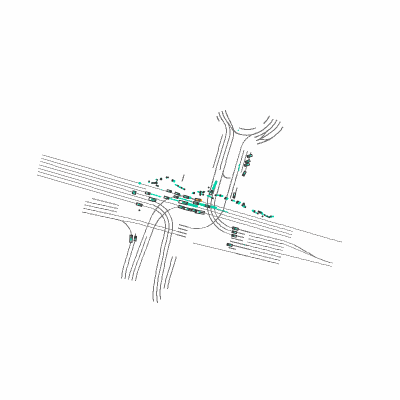
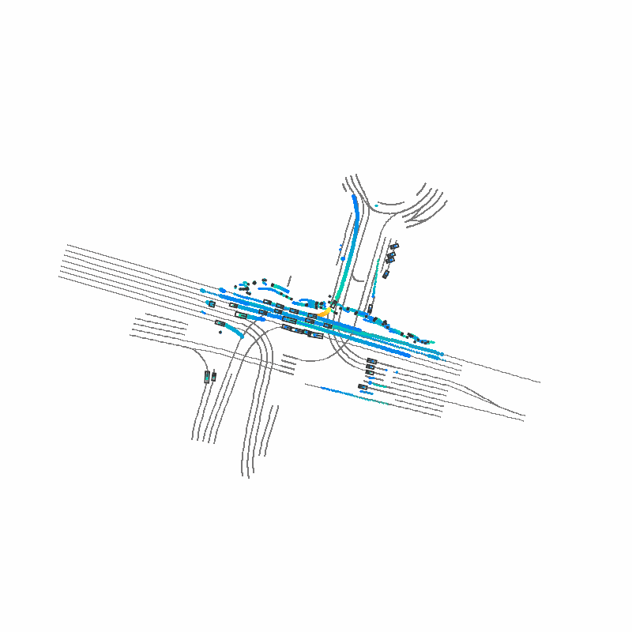
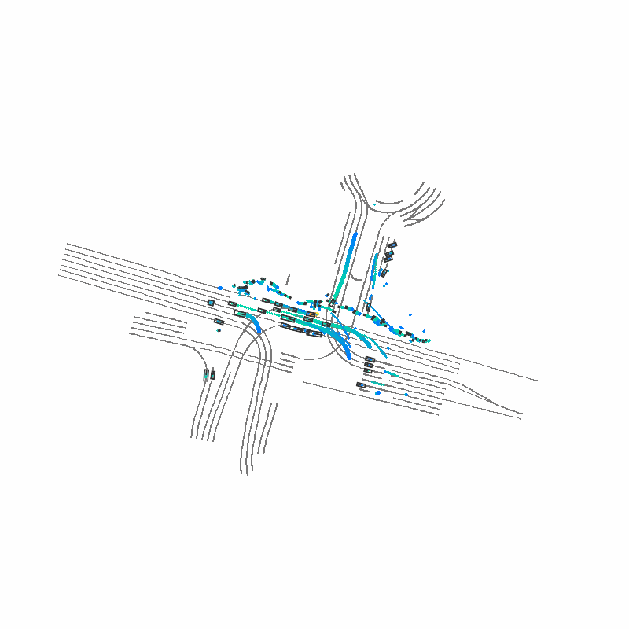

To make it easier to get started, we've prepared a basic pipeline that guides users from data caching to data generation and visualization.

**Usage steps:**

1. **[Prepare the environment](install.md)**
2. **[Download the nuplan dataset](prepare_dataset.md)** 
3. **[Download the model checkpoint](train_eval.md#checkpoints)** from Huggingface (or your specified location).
4. **Edit the `update_config` function in `scripts/pipeline/pipeline.py`** to specify your nuplan data root, map root, and checkpoint path, for example:
   ```python
   cfg.scenario_builder.data_root = '/path/to/your/nuplan/data'
   cfg.scenario_builder.map_root = '/path/to/your/nuplan/maps'
   cfg.checkpoint = '/path/to/your/model.ckpt'
   ```
5. **Run the pipeline:**
   ```bash
   python scripts/pipeline/pipeline.py
   ```
After running pipeline.py, you will see three kinds of visualization GIFs in the `scripts/pipeline/` directory:

1. `task_condition.gif` - Shows the scene conditions and context
{width=300}
2. `task_gt.gif` - Shows the ground truth trajectories of all agents
{width=300}
3. `task_pred.gif` - Shows the model's predicted trajectories
{width=300}

No additional parameters are needed if the above paths are set correctly in the config.
